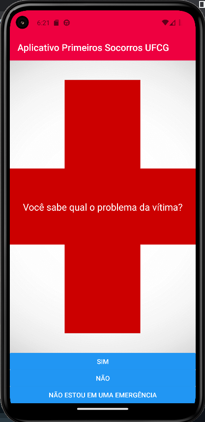
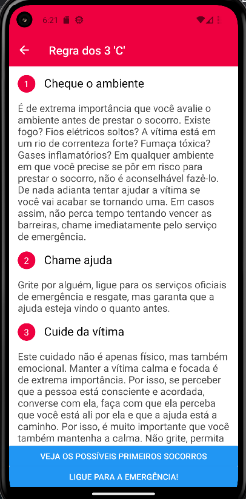
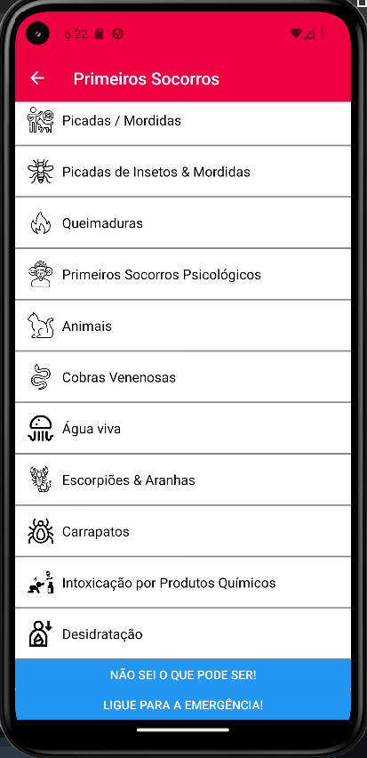
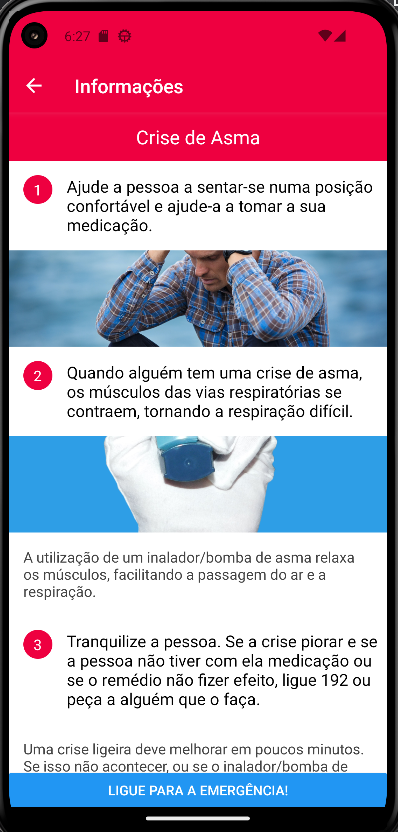
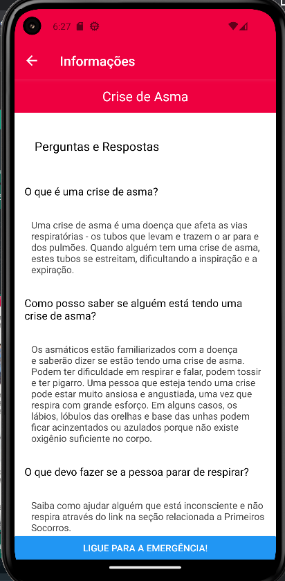

# Projeto Primeiros Socorros

## Projeto apresentado na disciplina "Projeto I".

O Aplicativo "Primeiros Socorros" foi desenvolvido com o intuito de auxiliar nos primeiros socorros.
Nele estão disponíveis informações em texto e imagens sobre como realizar um primeiro socorro

# Prints da aplicação

